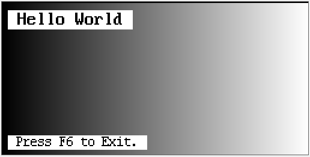
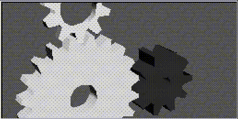
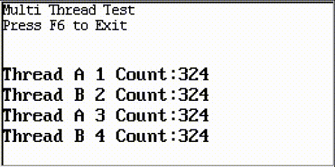

# [ExistOS-APP-Demo](https://github.com/ExistOS-Team/ExistOS-App-demo)


Exist OS APP开发指南

## 简介

本仓库主要用于存放APP开发相关的教程、API用法以及示例工程项目。


## APP开发环境搭建

    应用开发环境和系统开发环境类似，安装CMake、gcc-arm-none-eabi 10.3版本、Ninja/GNU Make并配置好环境变量即可。

项目的创建只需将 `example_0_empty` 该空白工程复制过来修改为自己的项目名即可。

### APP编译

APP运行时需要调用相关的系统函数以及运行库，引出编译前需将系统的符号表 `sys_symtab.txt` 放置在项目工程源码目录下（即.crt.c所在目录）

## 当前Demo APP示例说明

`example_0_empty` 实现了一个最小的Exist OS APP构建过程，APP程序从main.c的main函数开始执行，并展示了系统简单API的使用（如直接写屏绘图、写出文本以及按键API）。



`example_1_LvGL` 示范了系统LvGL库的使用，实现了一个GUI窗口程序的运行流程。


`example_2_TinyGL` 提供了引入外部图形库TinyGL（OpenGL子集）渲染3D图形的示范，以及FatFS文件系统操作文件的简单示例。




`example_3_doom` 演示了较大型app如doom移植的示例工程。


`example_4_multithread` 提供一个使用FreeRTOS进行多线程编程的示范。



## API简单参考

系统自带相关库以及提供的API函数声明均在项目工程的`include`目录下，`include/existosapi`内为系统提供最基本功能的API，包括屏幕原生绘图，按键获取等。`syscall.h`为系统最底层API，提供了如Flash FTL层扇区读写、CPU电源管理、频率控制等API。

### basic_api.h 

---
```c
void api_vram_initialize(uint8_t *vram_addr);
```

初始化帧缓冲区

`vram_addr` : 用户提供帧缓冲区地址，可以通过malloc或定义数组。

---

```c
void *api_vram_get_current(void);
```

获取已经初始化帧的缓冲区。

---


```c
void api_vram_flush(void);
```

刷新显示帧缓冲区，一般情况下写入帧缓冲区时屏幕不会显示，需要通过该函数刷新方可显示。

---

```c
void api_vram_clear(uint16_t color);
```

用给定颜色填充整个缓冲区。

---

```c
void api_vram_put_char(int x0, int y0, char ch, int fg, int bg, int fontSize);
```

在给定坐标(`x0`,`y0`)输出一个字符`ch`, `fg`为前景色（即字体颜色），`bg`为背景色，`fontSize`字号可选8、12、16。

---

```c
void api_vram_put_string(int x0, int y0, char *s, int fg, int bg, int fontSize);
```

在给定坐标(`x0`,`y0`)输出一个字符串`s`, `fg`为前景色（即字体颜色），`bg`为背景色，`fontSize`字号可选8、12、16，字符串超出屏幕右边后会到下一行从头继续输出。

---

```c
void api_vram_set_pixel(uint32_t x, uint32_t y, uint8_t c);
```

设置给定坐标(`x`,`y`)处的像素点颜色。

---

```c
void api_vram_draw_HLine(int y, int x1, int x2, unsigned short c);
```

在`y`处绘制一条从`x1`到`x2`颜色为`c`的水平线。

---

```c
void api_vram_draw_VLine(int x, int y1, int y2, unsigned short c);
```

在`x`处绘制一条从`y1`到`y2`颜色为`c`的垂直线。

---

```c
void api_vram_draw_line(int x1, int y1, int x2, int y2, unsigned short c);
```

从(`x1`,`y1`)到(`x2`,`y2`)绘制一条颜色为`c`的线段。

---

```c
void api_vram_fill_rect(int x, int y, int w, int h, unsigned short c);
```

以(`x`,`y`)为左上角填充一个宽`w`高`h`颜色为`c`的矩形

---

```c
int api_get_key(int check_key);
```

获取按键输入或状态。

若`check_key`为`-1`，则进入阻塞状态无限等待，直到有按键按下后返回键值（键值见`keyboard_gii39.h`）。

若`check_key`为某个键值，则立即返回所给键值在该函数调用时刻是否按下。

